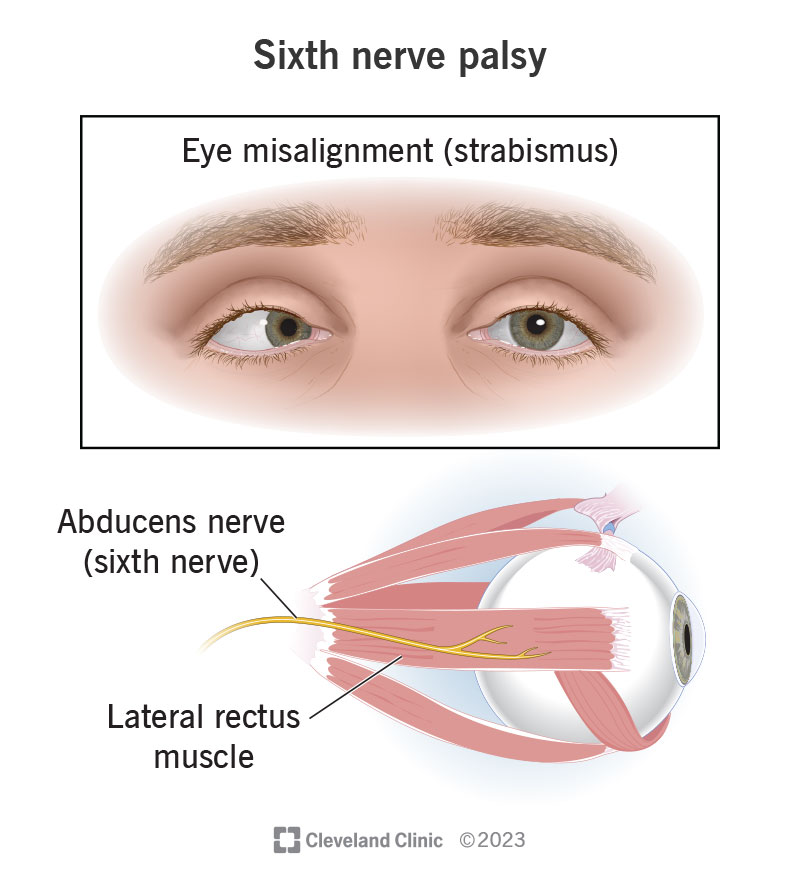
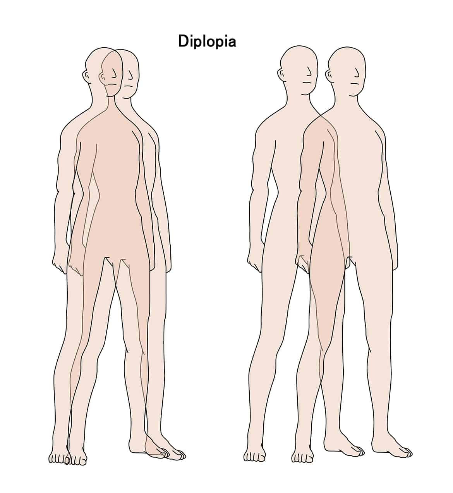

Neuro-ophthalmology is a specialized field of medicine that deals with disorders affecting the visual system, particularly those related to the brain and the nerves that control eye movements. 

    <iframe title="Optic nerve and Brain" frameborder="0" allowfullscreen mozallowfullscreen="true" webkitallowfullscreen="true" allow="autoplay; fullscreen; xr-spatial-tracking" xr-spatial-tracking execution-while-out-of-viewport execution-while-not-rendered web-share src="https://sketchfab.com/models/616af990018a4474bbda0aabb55ac2d7/embed"></iframe>
    

        
        by <a href="https://sketchfab.com/qkrej96?utm_medium=embed&utm_campaign=share-popup&utm_content=616af990018a4474bbda0aabb55ac2d7" target="_blank" rel="nofollow" style="">EUNJUNG PARK</a>
    

Unfortunately, millions of people around the world suffer from neuro-visual disorders. Prevalent conditions are described below:

<body>

    

      
Cranial Nerve Abnormalities

      

        
Cranial nerve abnormalities affecting the eye muscles can result in strabismus, ptosis (drooping eyelid), or abnormal pupil responses, depending on the specific nerve affected. These abnormalities may also lead to difficulties in controlling eye movements and coordinating binocular vision.

        
Most commonly, the abducens nerve, also referred to as cranial nerve six (CN VI) is impinged. It plays a role in controlling the eye's extraocular motor functions, alongside the oculomotor nerve (CN III) and the trochlear nerve (CN IV). Thus, its malfunction can result in hindered eye movement.

        
      

    

    

      
Double Vision

      

        
Double vision, also known as diplopia, can be caused by various factors such as muscle weakness, nerve damage, or eye misalignment. Treatment often involves addressing the underlying cause which could include diabetes, Graves' disease, and many others. It can significantly impact daily activities such as reading, driving, or watching television. 
        

      

    

  
Giant Cell Arteritis

  

    
Giant cell arteritis primarily affects individuals over 50 and is characterized by inflammation of medium and large arteries, including those supplying the eyes and brain. Prompt diagnosis and treatment are crucial to prevent serious complications such as vision loss or stroke.

  

  
Idiopathic Intracranial Hypertension

  

    
Idiopathic intracranial hypertension is more common in obese individuals and may be managed through lifestyle modifications, medications, and sometimes surgical interventions. It can lead to symptoms such as headaches, pulsatile tinnitus, and visual disturbances.

  

  
Ischemic Optic Neuropathy

  

    
Ischemic optic neuropathy can be categorized into anterior and posterior types, with anterior ischemic optic neuropathy typically associated with sudden vision loss in older individuals. Risk factors include hypertension, diabetes, and smoking.

  

  
Migraine

  

    
Migraine-associated visual disturbances, such as scotomas or flashing lights, are often referred to as migraine aura and can precede or accompany migraine headaches. Visual symptoms can vary widely and may include blurry vision, tunnel vision, or temporary blindness in one eye.

  

  
Myasthenia Gravis

  

    
Myasthenia gravis can affect not only the eye muscles but also other skeletal muscles, leading to generalized weakness and fatigue. Symptoms often worsen with activity and improve with rest or certain medications.

  

  
Nystagmus

  

    
Nystagmus can be classified based on its characteristics, including jerk, pendular, or gaze-evoked nystagmus, each with different underlying causes and management approaches. It can be congenital or acquired and may be associated with neurological conditions or inner ear disorders.

  

  
Optic Neuritis

  

    
Optic neuritis is characterized by inflammation of the optic nerve, leading to symptoms such as vision loss, eye pain, and changes in color perception. It is commonly associated with demyelinating conditions like multiple sclerosis.

  

  
Papilledema

  

    
Papilledema is a serious condition that requires prompt medical attention to prevent permanent vision loss and manage the underlying cause of increased intracranial pressure. It is often associated with conditions such as brain tumors, meningitis, or idiopathic intracranial hypertension.

  

  
Pseudotumor Cerebri

  

    
Pseudotumor cerebri is often associated with symptoms such as pulsatile tinnitus, transient visual obscurations, and neck pain, indicating increased intracranial pressure. It may require treatments such as medications to reduce cerebrospinal fluid production or surgical interventions in severe cases.

  

  
Thyroid Eye Disease

  

    
Thyroid eye disease is often accompanied by systemic symptoms such as weight loss, palpitations, and heat intolerance due to its association with thyroid dysfunction. In severe cases, it can lead to proptosis (bulging eyes), double vision, and vision loss if not managed promptly.

  

  

  
</body>

### Sources
- <a href="https://binettereyecentre.com.au/" target="_blank">Binetter Eye Centre</a>
- <a href="https://my.clevelandclinic.org/health/diseases" target="_blank">Cleveland Clinic</a>
- <a href="https://www.nei.nih.gov/" target="_blank">National Eye Institute (NEI)</a>
- <a href="https://en.wikipedia.org/wiki/Neuro-ophthalmology" target="_blank">Wikipedia</a> 