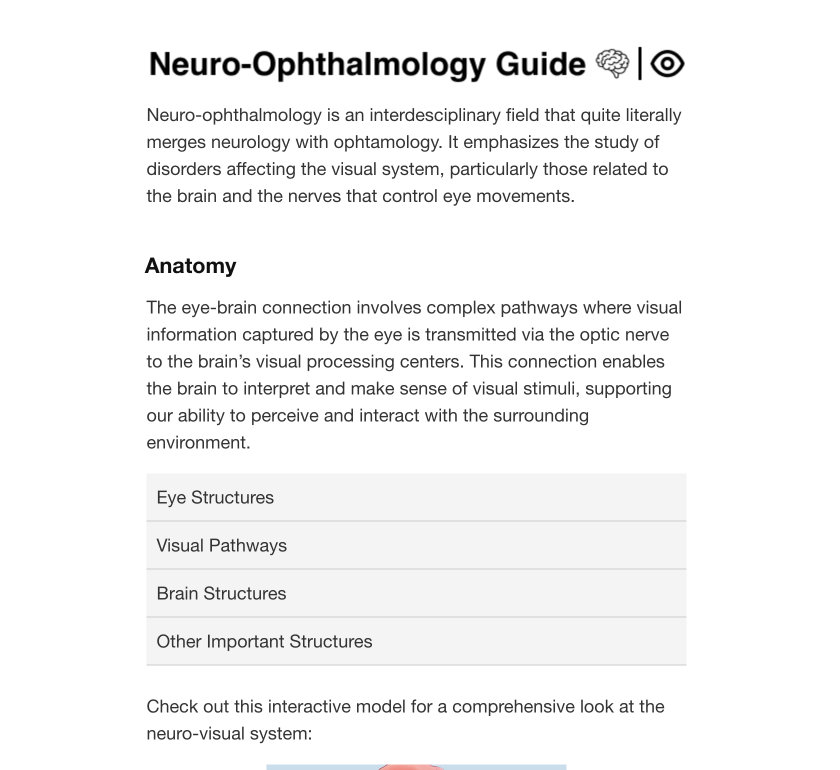

# Passion Projects

  

    

      

        

          

            
            

          

          
A neuro-ophthalmology guide I created for my NCSSM online neuroscience class.

        

      

      

        

          

            
            

          

          
Description of another project.

        

      

      

        

          

            
            

          

          
Description of another project.

        

      

    

  

# Research

  

    

      

        

          

            
            

          

          
Description of another project.

        

      

      

        

          

            
            

          

          
Description of another project.

        

      

      

        

          

            
            

          

          
Description of another project.

        

      

    

  

